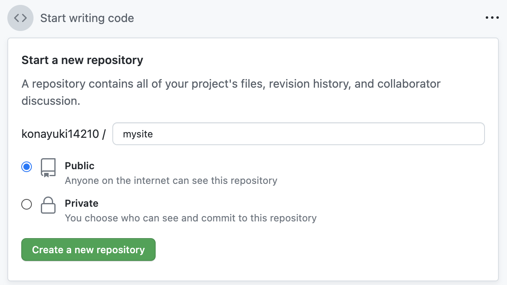
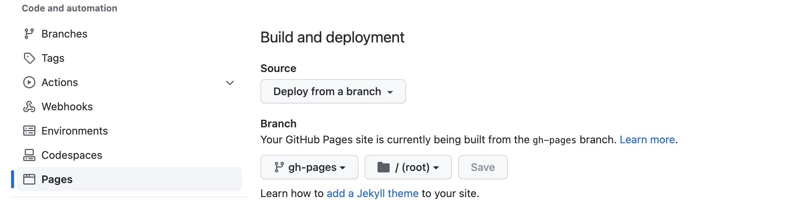

この記事は [TDU Advbent Calendar 2022 22日目](https://qiita.com/advent-calendar/2022/tdu)の記事です。<br>

## 初めに
世にはいろいろなブログサービスやCMSやらが溢れていますが、かなりお手軽に個人の静的サイト構築できる方法としてHugo+GithubPagesが挙げられるのではないかと勝手に思っています。
私自身、Hugoに触れたのは最近のことだったのですが、あまりにスムーズに構築できたので感動しました。<br>
ので、今回は慣れていれば3分ほどで出来そうな静的サイト構築の手順を備忘録がわりに記載しておこうと思った次第です。<br>

## 構築していこう！
はい、構築していきます。<br>

### 1. リモートリポジトリを作る (30秒)
まずはGithubにリモートリポジトリを作っておきましょう。<br>

今回はリポジトリ名を「mysite」にしました。<br>

### 2. Hugoのインストール　(15秒)
自分の環境にHugoをインストールしましょう。<br>
公式のクイックスタート通りにやれば特に問題ないはず。<br>
```sh
$ brew install hugo
```
自分はbrewで入れました。<br>

### 3. サイトの作成　(30秒)
インストールできたら早速サイトの方を作っていきます。<br>
今回はpagesで公開するのでgithubのユーザー名から以下のような形で生成します。<br>
```sh
$ hugo new site [githubのusername].github.io
$ cd [githubのusername].github.io
$ git init .
```

### 4. テーマの導入と設定　(30秒)
Hugoにはいろいろなテーマがあるのですが、今回はクイックスタートでも使われている「ananke」を使っていきます<br>
```sh
git submodule add https://github.com/budparr/gohugo-theme-ananke.git themes/ananke
```
テーマの反映にはconfig.tomlを変更する必要があります。<br>
themeの行を追加し、anankeを指定します。<br>
ついでにbaseURLもリポジトリの名前を追加しておきます<br>
```sh
theme = "ananke"
baseURL = "http://example.org/mysite/"
languageCode = "en-us"
title = "My New Hugo Site"
```

### 5. ページの追加　(30秒)
ページを追加しましょう。<br>
```sh
$ hugo new posts/hello-world.md
```
.mdファイルが作成されるので記事を書きます。<br>
---で囲まれたメタ情報部分の<br>
```
draft: true
```
をfalseに変更することで記事が公開状態になり、サイト上に表示されます。<br>
ローカルで確認する場合は、<br>
```
hugo serve
```
とすることで http://localhost:1313 に立ち上がります。<br>

### 6. Github Actionsを設定する　(30秒)
Actionsを作って下さっている方がいるのでこちらを使用していきます。<br>
https://github.com/peaceiris/actions-hugo

```yml
name: GitHub Pages

on:
  push:
    branches:
      - main  # Set a branch to deploy
  pull_request:

jobs:
  deploy:
    runs-on: ubuntu-22.04
    concurrency:
      group: ${{ github.workflow }}-${{ github.ref }}
    steps:
      - uses: actions/checkout@v3
        with:
          submodules: true  # Fetch Hugo themes (true OR recursive)
          fetch-depth: 0    # Fetch all history for .GitInfo and .Lastmod

      - name: Setup Hugo
        uses: peaceiris/actions-hugo@v2
        with:
          hugo-version: '0.91.2'
          # extended: true

      - name: Build
        run: hugo --minify

      - name: Deploy
        uses: peaceiris/actions-gh-pages@v3
        if: ${{ github.ref == 'refs/heads/main' }}
        with:
          github_token: ${{ secrets.GITHUB_TOKEN }}
          publish_dir: ./public
```
細かく設定できるのですが、とりあえずコピペでOKです。<br>
.github/workflows/gh-pages.yml に保存します。<br>
あとは先ほど作成したリポジトリにpushするだけで自動でActionsが走り、ビルドとデプロイを行なってくれます。とっても便利！<br>
```
git remote add origin git@github.com:[githubのusername]/mysite.git
git branch -M main
git add --all
git commit -m 'first commit'
git push -u origin main
```

### 7. Pagesで公開する　(15秒)
pushしたリポジトリのSettingsタブからPagesを開き、Branchをgh-pagesに変更します。<br>
ディレクトリはrootを指定してSave、これでActionsのビルド+Pushが終われば確認できるはずです。<br>


## お疲れ様でした
このブログもここに書いた手法と同じように作成したものなので、大体同じようなものが出来てると思います。<br>
近年では個人サイトの時代が再来しそうな雰囲気もしてきているので皆さんご自身のサイトをこの機会に持ってみてもいいのではないでしょうか？<br>
それではお体に気をつけて良い年末をお過ごしください！<br>